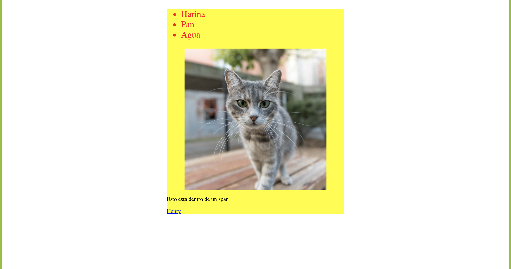
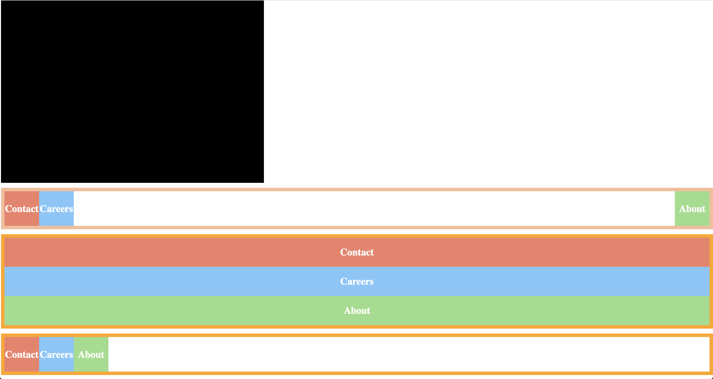

# Henry

## Prep Checkpoint

### Fork

Primero debes **forkear** este repo, haciendo click en el botón `fork` de arriba a la derecha.

Ahora ya tenés una copia de este repo en tu cuenta de `github`.
Cloná el repo dentro de una carpeta que vos elijas en tu compu. Una vez clonado entrá a esa carpeta y ejecutá los siguentes comandos:

```bash
npm install
npm test
```

Si ves los tests fallando, estás listo para comenzar.

## Consignas

El checkpoint de hoy consiste en tres partes:

    * Teoría (10% del puntaje total)
    * Práctica (JS) (70% del puntaje total)
    * Práctica (html y css) (20% del puntaje total)


### Teoría

En la parte teórica vas a tener que explicar *con tus propias palabras* los conceptos que te pedimos. Las consignas y respuestas estarán en `teoria.md`

### JavaScript

En la parte práctica, te vamos a brindar los tests preparados, tu tarea es completar el código en `checkpoint.js` de tal forma que pasen la mayoría de los tests. Para ejecutar los tests, primero debes tirar el comando `npm test` dentro esta carpeta.

>Antes de npm test, deberías haber instalado las dependencias con `npm install`

### HTML y CSS

## Ejercicio 1

Vas a trabajar en el archivo `ejercicio1.html`, que deberá ser un documento HTML válido (tags html, head, y body) que tenga los siguentes elementos:

    * un div que contenga todo lo demás.
    * una lista desordenada con tres elementos con texto.
    * una imagen.
    * un párrafo que contenga un span.
    * un link a una página de tu elección.

Debes crear una hoja de estilos **externa** llamada `estilo1.css` y dentro escribir las reglas necesarias tal que:

    * el div contenedor tiene que tener un ancho de 500px, el color de fondo amarillo y estar centrado.
    * Los elementos de la lista deben tener un tamaño de letra de 25px y ser de color rojo.
    * la imagen debe estar centrada.
    * el color del link una vez que se haya clickeado debe ser verde.

  ### Deberia quedar asi
  

## Ejercicio 2

En este ejercicio vas trabajar en `ejercicio2.html`, escribiendo código para que contenga:

* un div con el id #div-negro de color negro y tengas las siguientes propiedades:
    - un margin de 30 px arriba y abajo.
    - un borde superior de 1px, el inferior de 30px, el izquierdo de 1 px y el derecho de 20px, todos de color negro y estilo `solid`
    - padding de 10px arriba y abajo, y 5px izquierda y derecha.
    - el div debe tener un tamaño definido, podés elegir cualquier tamaño.
* Usando `flex` y usando esté código html:
    ```html
        <div id="uno">
          <div id='uno-contact'>Contact</div>
          <div id='uno-careers'>Careers</div>
          <div id='uno-about'>About</div>
        </div>
        <div id="dos">
          <div id='dos-contact'>Contact</div>
          <div id='dos-careers'>Careers</div>
          <div id='dos-about'>About</div>
        </div>
        <div id="tres">
          <div id='tres-contact'>Contact</div>
          <div id='tres-careers'>Careers</div>
          <div id='tres-about'>About</div>
        </div>
    ```
    Debes crear los siguientes layouts (copiar y pegar el código de arriba):
    Usando los id de cada div y aplicando las reglas de css necesarias debes crear los siguientes layouts

    >pista para el primero podes usar margin-left: auto;

    ### Deberia quedar asi
    

    Finalmente, usar tus conocimientos de position, para dejar el primero (id #uno) de la lista que quede siempre fijo en la parte inferior de la pantalla.

## Subir tu checkpoint

Antes de las 18h, debes subir un commit a tu repo. Para hacerlo, los pasos a seguir son (parados desde esta carpeta):

```bash
git add .
git commit -m 'checkpoint commit'
git push origin master
```
Chequéa que veas los cambios reflejados en el repo de tu cuenta de github!

**Notas**:
* Sólo podés consultar a los PM y al instructor por problemas de consignas o si no te funcionan los tests.
* Hay cosas puntuales que tal vez no vimos específicamente en los lectures, vas a tener que investigar un poquito por tu cuenta.
* Tenes que subir el resultado del challenge antes de las 18:00 PM.
* Podés buscar en internet o en cualquier otro lugar por recursos para que te ayudes.
* No podés ayudar ni preguntar a tus compañeros de clases.